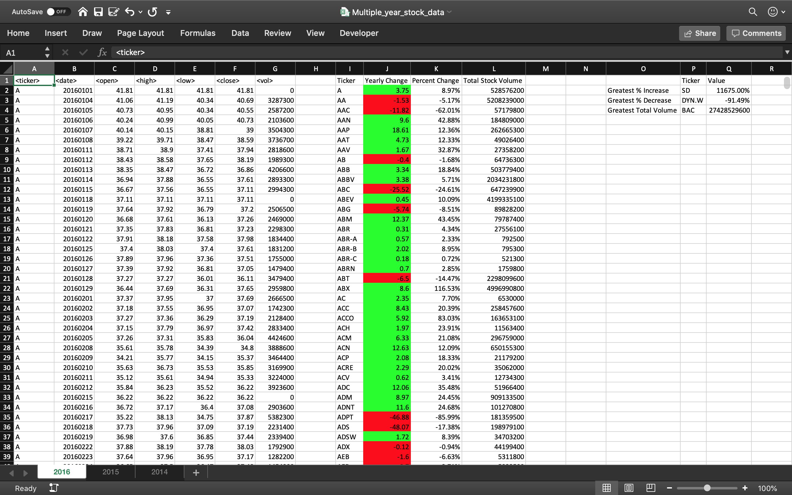

# VBA-challenge

## Introduction

This project helps to automate calculations and excel sheet processes using two exel files saved in the resources folder. One file is for test de vba script and the other is for the production.

This script loop through all the stocks for one year for each run and take the following information:

- The ticker symbol.
- Yearly change from opening price at the beginning of a given year to the closing price at the end of that year.
- The percent change from opening price at the beginning of a given year to the closing price at the end of that year.
- The total stock volume of the stock.
- You should also have conditional formatting that will highlight positive change in green and negative change in red.

The script also return the stock with the "Greatest % increase", "Greatest % Decrease" and "Greatest total volume"

## Output

The next image shows the results.

